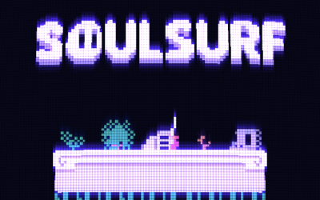

# Soul Surf
Resurrect dead heroes and use their various attributes to navigate the levels.

JS13K 2022 Entry

## **⌨️ CONTROLS**
### **General**
* R = Reset stage
* Escape = Return to menu
### **Soul**
* Arrow keys = Move
* X = Resurrect corpse / Select menu option

### **Characters**
* Arrow keys = Move
* Down arrow = Enter door / Toggle switch
* X = Attack

### **Level Editor**
* IJKL = Navigate the menu
* X/C = Place/Remove object
* Enter = Play level
* 1 = Copy stage to clipboard
* 2 = Paste from clipboard or enter stage code

## **🔨 LEVEL EDITOR GUIDE**
### **Empty (0)**

### **Block (1)**
* **Param 1** Block type

### **Soul Spawn (2)**
Starting point for the soul (no params)

### **Character Spawn (3)**
Spawns a character

* **Param 1** - Character type

* **Param 2** - Dead / Alive

### **Pickup (4)**
Key that opens the door (no params)

### **Door (5)**
Door to the next level (no params)

### **Laser turret (6)**
Emits lasers (stopped by blocks)
* **Param 1** - Switch ID
* **Param 2** - On by default

### **Hologram block (7)**
Acts as a block when switched on
* **Param 1** - Switch ID
* **Param 2** - On by default

### **Switch (8)**
Toggles Hologram Blocks & Laser Turrets
* **Param 1** - Switch ID
* **Param 2** - On by default
* **Param 3** - Timer

### **Spikes (9)**
Kills player
